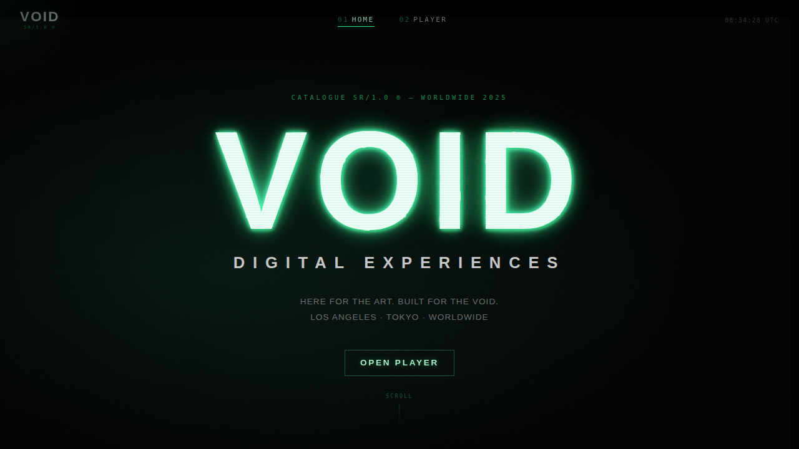
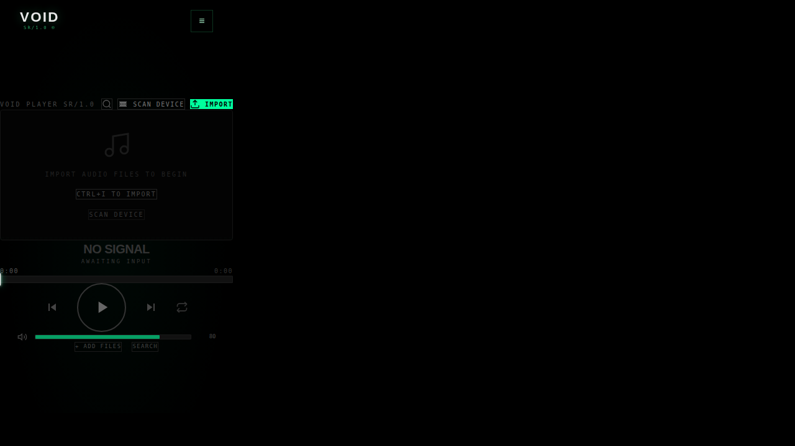
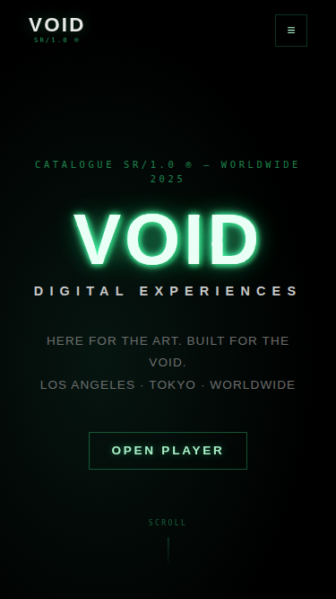
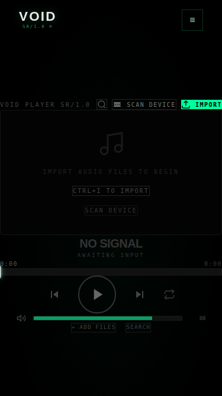

# 🎵 **Live Site:** [https://anacondy.github.io/Void-player-/](https://anacondy.github.io/Void-player-/)

# Void Player

Cyberpunk-inspired music player built with React + Vite + TypeScript.

## Screenshots

### Desktop



### Mobile



## Changelog

📋 **[View Full Changelog](./CHANGELOG.md)** - Detailed history of all changes, features, and improvements.

## Development

```bash
npm ci
npm run dev
```

## Build & Test

```bash
npm run test
```

This runs type-checking and production build validation.

## Deployment

Deployment is automated with GitHub Actions (`.github/workflows/deploy.yml`) and publishes to GitHub Pages on pushes to `main`.
